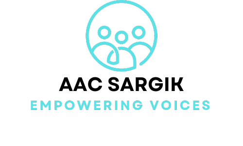

<!-- Credit For ReadMe Template: https://github.com/othneildrew/Best-README-Template -->

  [![LinkedIn][linkedin-shield]][linkedin-url]

<!-- PROJECT LOGO -->
 

  

  

    A Hybrid Application Developed to assist people with communication disorders.
     
    <a href="https://docs.google.com/document/d/1Vf7a0hJ0Omivf7n4EL5pFZnZP1rVqG8_AveRfo2a9zo/edit#heading=h.gjdgxs"><strong>Explore the docs »</strong></a>
     
     
    <a href="https://drive.google.com/file/d/1rJ1QC9av0s4iPJI5MOAI2n1suzIJdIpK/view?usp=sharing">View Demo</a>
    ·
    <a href="https://github.com/RobinRosculete/AAC-SARGIK/issues/new?labels=bug&template=bug-report---.md">Report Bug</a>
    ·
    <a href="https://github.com/RobinRosculete/AAC-SARGIK/issues/new?labels=enhancement&template=feature-request---.md">Request Feature</a>
  

<!-- ABOUT THE PROJECT -->
## About The Project

### Project Vision
At AAC SARGIK, our vision is dedicated to empowering the voices of individuals who need communication and speech assistance. People will use AAC SARGIK to be able to express themselves and better communicate with those around them. We provide a patient-friendly, inclusive, and customizable solution, enabling seamless communication. To reduce the financial burden on individuals and bridge the gap left by existing IOS-only options.

### Built With

- [Angular](https://angular.dev/)
- [ASP.NET](https://dotnet.microsoft.com/en-us/apps/aspnet)
- [Ionic](https://ionicframework.com/docs/)
- [YOLOv8](https://docs.ultralytics.com/)
- [OpenAI API](https://openai.com/index/openai-api/)

<!-- CONTACT -->

## Contact

Robin Rosculete - rrosculete@gmail.com

<!-- ACKNOWLEDGMENTS -->

## Members

- Armon Lee
- Gagik Papoyan
- Ian Valle
- Kaijing Zheng
- Robin Rosculete
- Sarkis Shil-Gevorkyan

<!-- MARKDOWN LINKS & IMAGES -->
<!-- https://www.markdownguide.org/basic-syntax/#reference-style-links -->

[linkedin-shield]: https://img.shields.io/badge/-LinkedIn-black.svg?style=for-the-badge&logo=linkedin&colorB=555
[linkedin-url]: https://www.linkedin.com/in/robin-rosculete-b51641202/
[product-screenshot]: images/screenshot.png

